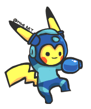
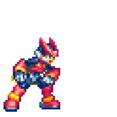

## Hi there, I'm Liverson Paulo 👋

    
    

        <b>🔭 I’m interested on:</b>
        

            - Engines and game development 
            - Scalable backend architetures 
            - Multiplatform mobile development 
        

        <b> I’m currently learning:</b>  
        

            - Unity 
            - C# 
            - C++ 
        

        <b>📫 How to reach me:</b>  
        
         
        <b>😄 Pronouns:</b>  
        
he/his

    

    
    

        <b>Languages</b> 
        
        
        
        
         <b>Frameworks</b> 
        
        
        
        
         <b>Tools</b> 
        
        
        
        
    

 

<!--
**liversonp/liversonp** is a ✨ _special_ ✨ repository because its `README.md` (this file) appears on your GitHub profile.

Here are some ideas to get you started:
-->
